HW02
================

I will be using the gapminder data set for this exploration

``` r
library(gapminder)
library(tidyverse)
```

    ## -- Attaching packages ----------------------------------------------------- tidyverse 1.2.1 --

    ## v ggplot2 3.0.0     v purrr   0.2.5
    ## v tibble  1.4.2     v dplyr   0.7.6
    ## v tidyr   0.8.1     v stringr 1.3.1
    ## v readr   1.1.1     v forcats 0.3.0

    ## -- Conflicts -------------------------------------------------------- tidyverse_conflicts() --
    ## x dplyr::filter() masks stats::filter()
    ## x dplyr::lag()    masks stats::lag()

First I will explore the data set to familiarize myself with
    it

``` r
class(gapminder)
```

    ## [1] "tbl_df"     "tbl"        "data.frame"

``` r
str(gapminder)
```

    ## Classes 'tbl_df', 'tbl' and 'data.frame':    1704 obs. of  6 variables:
    ##  $ country  : Factor w/ 142 levels "Afghanistan",..: 1 1 1 1 1 1 1 1 1 1 ...
    ##  $ continent: Factor w/ 5 levels "Africa","Americas",..: 3 3 3 3 3 3 3 3 3 3 ...
    ##  $ year     : int  1952 1957 1962 1967 1972 1977 1982 1987 1992 1997 ...
    ##  $ lifeExp  : num  28.8 30.3 32 34 36.1 ...
    ##  $ pop      : int  8425333 9240934 10267083 11537966 13079460 14880372 12881816 13867957 16317921 22227415 ...
    ##  $ gdpPercap: num  779 821 853 836 740 ...

``` r
names(gapminder)
```

    ## [1] "country"   "continent" "year"      "lifeExp"   "pop"       "gdpPercap"

``` r
ncol(gapminder)
```

    ## [1] 6

``` r
nrow(gapminder)
```

    ## [1] 1704

Now I can see that it is a tibble data.frame, I can see the column
headers, and number of columns and rows.

Next I will explore a bit more information about countries and their
populations

``` r
summary(gapminder)
```

    ##         country        continent        year         lifeExp     
    ##  Afghanistan:  12   Africa  :624   Min.   :1952   Min.   :23.60  
    ##  Albania    :  12   Americas:300   1st Qu.:1966   1st Qu.:48.20  
    ##  Algeria    :  12   Asia    :396   Median :1980   Median :60.71  
    ##  Angola     :  12   Europe  :360   Mean   :1980   Mean   :59.47  
    ##  Argentina  :  12   Oceania : 24   3rd Qu.:1993   3rd Qu.:70.85  
    ##  Australia  :  12                  Max.   :2007   Max.   :82.60  
    ##  (Other)    :1632                                                
    ##       pop              gdpPercap       
    ##  Min.   :6.001e+04   Min.   :   241.2  
    ##  1st Qu.:2.794e+06   1st Qu.:  1202.1  
    ##  Median :7.024e+06   Median :  3531.8  
    ##  Mean   :2.960e+07   Mean   :  7215.3  
    ##  3rd Qu.:1.959e+07   3rd Qu.:  9325.5  
    ##  Max.   :1.319e+09   Max.   :113523.1  
    ## 

I have some basic information now about the values and distribution

\`\`\`

Next I will try some plots to visualize the data better

``` r
ggplot(gapminder, aes(x=lifeExp, y=pop)) + 
  geom_point()
```

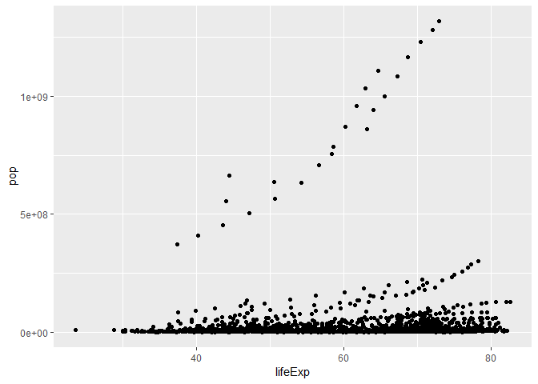<!-- -->

``` r
ggplot(gapminder, aes(gdpPercap, pop)) +
  geom_point()
```

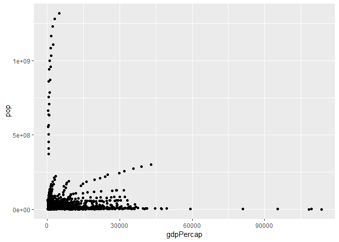<!-- -->

``` r
ggplot(gapminder, aes(lifeExp)) +
  geom_histogram(bins=50)
```

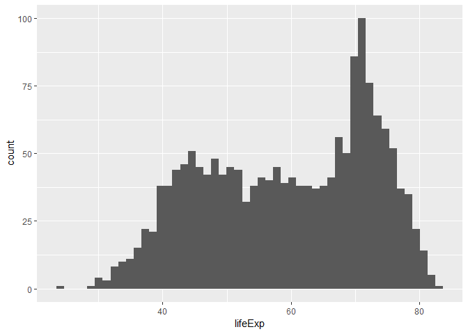<!-- -->

``` r
ggplot(gapminder, aes(lifeExp)) +
  geom_histogram() +
  scale_x_log10()
```

    ## `stat_bin()` using `bins = 30`. Pick better value with `binwidth`.

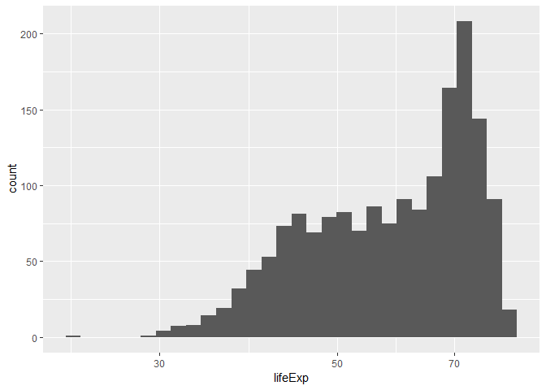<!-- -->

Now I will compare one category to one numberical variable and see what
looks best.

``` r
a <- ggplot(gapminder, aes(country, pop))

a + geom_boxplot()
```

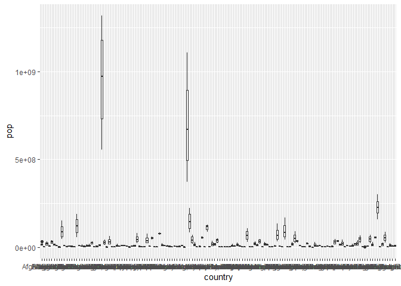<!-- -->

``` r
a + geom_violin()
```

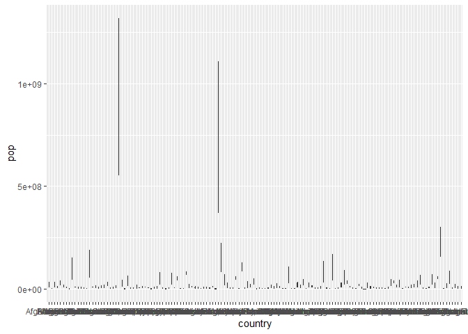<!-- -->

This is a lot of data to visualize this way so I will narrow it down to
continent instead.

``` r
ggplot(gapminder, aes(continent, pop)) +
  geom_boxplot()
```

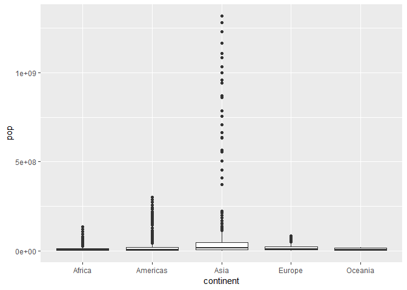<!-- -->

Now I’m going to filter my data to look at countries with life
expectancy greater than 50.

``` r
gapminder %>% 
  filter(lifeExp > 50)
```

    ## # A tibble: 1,213 x 6
    ##    country continent  year lifeExp     pop gdpPercap
    ##    <fct>   <fct>     <int>   <dbl>   <int>     <dbl>
    ##  1 Albania Europe     1952    55.2 1282697     1601.
    ##  2 Albania Europe     1957    59.3 1476505     1942.
    ##  3 Albania Europe     1962    64.8 1728137     2313.
    ##  4 Albania Europe     1967    66.2 1984060     2760.
    ##  5 Albania Europe     1972    67.7 2263554     3313.
    ##  6 Albania Europe     1977    68.9 2509048     3533.
    ##  7 Albania Europe     1982    70.4 2780097     3631.
    ##  8 Albania Europe     1987    72   3075321     3739.
    ##  9 Albania Europe     1992    71.6 3326498     2497.
    ## 10 Albania Europe     1997    73.0 3428038     3193.
    ## # ... with 1,203 more rows

Now I am curious about just life exp and population in the different
countries.

``` r
gapminder %>% 
select(country, lifeExp, pop)
```

    ## # A tibble: 1,704 x 3
    ##    country     lifeExp      pop
    ##    <fct>         <dbl>    <int>
    ##  1 Afghanistan    28.8  8425333
    ##  2 Afghanistan    30.3  9240934
    ##  3 Afghanistan    32.0 10267083
    ##  4 Afghanistan    34.0 11537966
    ##  5 Afghanistan    36.1 13079460
    ##  6 Afghanistan    38.4 14880372
    ##  7 Afghanistan    39.9 12881816
    ##  8 Afghanistan    40.8 13867957
    ##  9 Afghanistan    41.7 16317921
    ## 10 Afghanistan    41.8 22227415
    ## # ... with 1,694 more rows

Now I am just curious about countries in africa that have a life
expentancy greater than 50.

``` r
gapminder %>% 
  filter(lifeExp > 50) %>% 
  filter(continent == "Africa")
```

    ## # A tibble: 251 x 6
    ##    country continent  year lifeExp      pop gdpPercap
    ##    <fct>   <fct>     <int>   <dbl>    <int>     <dbl>
    ##  1 Algeria Africa     1967    51.4 12760499     3247.
    ##  2 Algeria Africa     1972    54.5 14760787     4183.
    ##  3 Algeria Africa     1977    58.0 17152804     4910.
    ##  4 Algeria Africa     1982    61.4 20033753     5745.
    ##  5 Algeria Africa     1987    65.8 23254956     5681.
    ##  6 Algeria Africa     1992    67.7 26298373     5023.
    ##  7 Algeria Africa     1997    69.2 29072015     4797.
    ##  8 Algeria Africa     2002    71.0 31287142     5288.
    ##  9 Algeria Africa     2007    72.3 33333216     6223.
    ## 10 Benin   Africa     1982    50.9  3641603     1278.
    ## # ... with 241 more rows

Now I will look at this data in terms of population and select that data
frame to do some plots. First I will assign my filter a variable and
then try different plots to see what looks best.

``` r
c <- gapminder %>% 
  filter(lifeExp > 50) %>% 
  filter(continent == "Africa")

c %>% 
  ggplot(aes(country,lifeExp)) +
  geom_point()
```

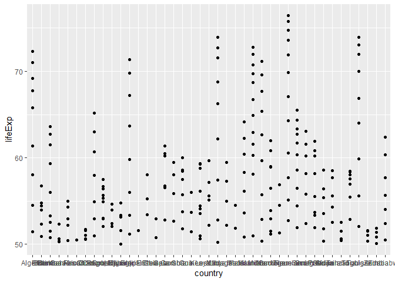<!-- -->

``` r
c %>% 
  ggplot(aes(country,lifeExp)) +
  geom_boxplot()
```

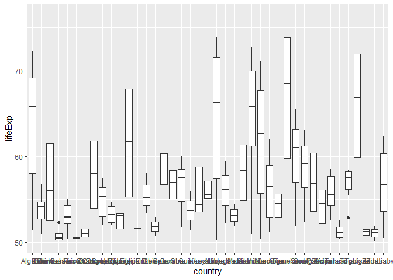<!-- -->

It’s difficult to see the labels so I looked up how to do the labels
vertically

``` r
c %>% 
  ggplot(aes(country,lifeExp)) +
  geom_boxplot() +
  theme(axis.text.x=element_text(angle=90))
```

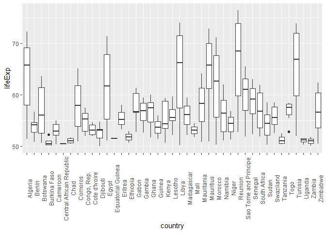<!-- --> Lets make it
colorful\!

``` r
c %>% 
  ggplot(aes(country,lifeExp)) +
  geom_boxplot(fill="tomato") +
  theme(axis.text.x=element_text(angle=90))
```

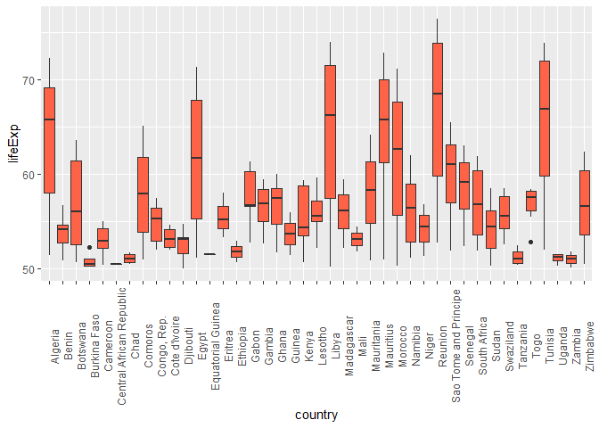<!-- -->
